# HashiBox

HashiBox is a local environment to simulate a highly-available cloud with
[Consul](https://www.consul.io/), [Nomad](https://www.nomadproject.io/), and
[Vault](https://www.vaultproject.io/). OSS and Enterprise versions of each
product are supported.

[Waypoint](https://www.waypointproject.io/) can be added but is optional. It also
installs [Docker](https://www.docker.com/) for running Nomad's jobs inside
containers.

It leverages [Vagrant](https://www.vagrantup.com/) for virtualization, and
[Bolt](https://puppet.com/docs/bolt/) for maintenance automation across nodes.

The main goal of HashiBox is to provide a local setup respecting environment
parity for simulating a Cloud Platform from end-to-end before going in production.

**Useful links:**
- [Website](https://hashibox.sh)
- [Get started](https://hashibox.sh/overview)

**Vagrant providers supported:**
- `parallels`
- `virtualbox`
- `vmware_desktop`

**Architectures supported:**
- `amd64`
- `arm64`

**Notes about the environment:**
- ACLs are enabled and automatically bootstrapped in Consul and Nomad. To simplify
  the setup, the bootstrapped tokens are used in favor of scope-defined ones.
- To simplify the setup, TLS across Consul, Nomad, Vault, and Waypoint is not
  configured.
- Only Vault *server* is leveraged. Vault agents in *client* mode are not setup
  since we don't use it. Feel free to make a pull request to support it.
- We could have leveraged Vagrant's *sync folders* instead of Bolt for file
  sharing with machines. Bolt is a better choice for *production-practices*
  but also for automating scripts across nodes.

## Summary schema

<picture>
  <source media="(prefers-color-scheme: light)" srcset="./assets/hashibox-light.png">
  <source media="(prefers-color-scheme: dark)" srcset="./assets/hashibox-dark.png">
  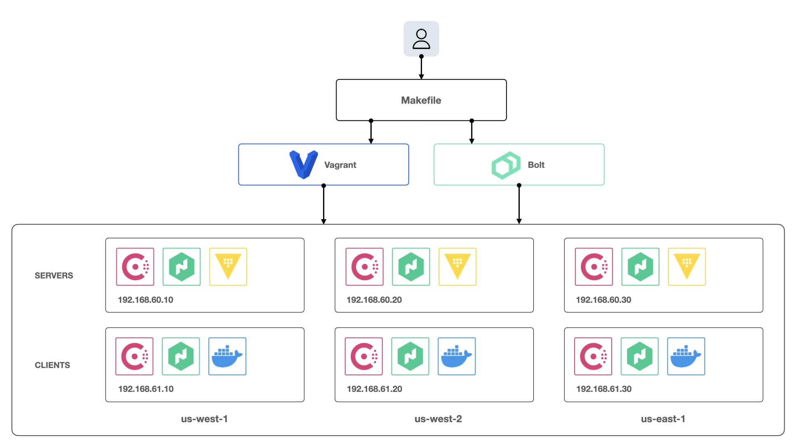
</picture>

## Screenshots

  
Consul

   

  

  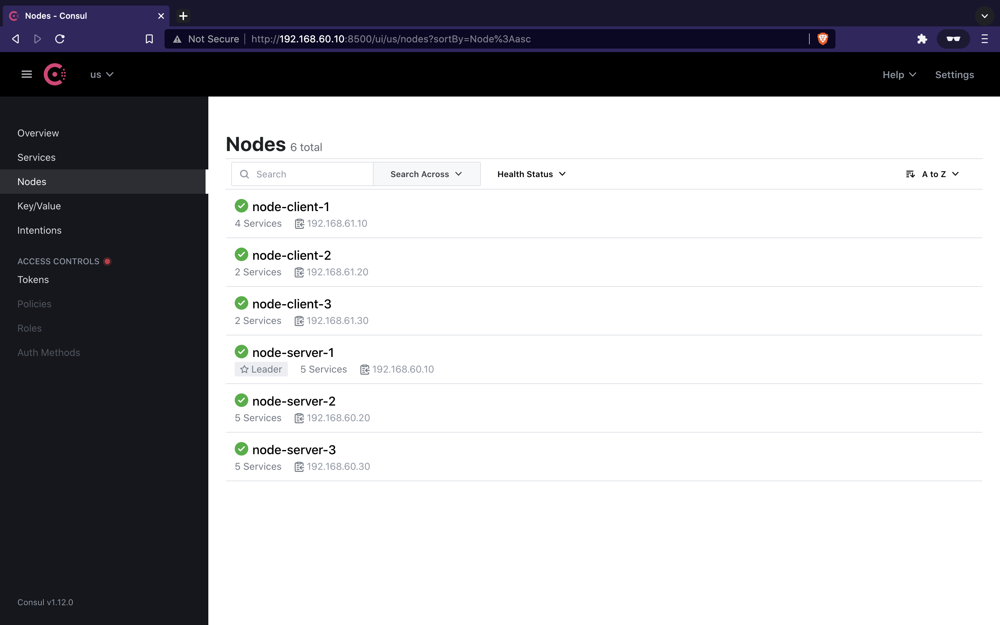

  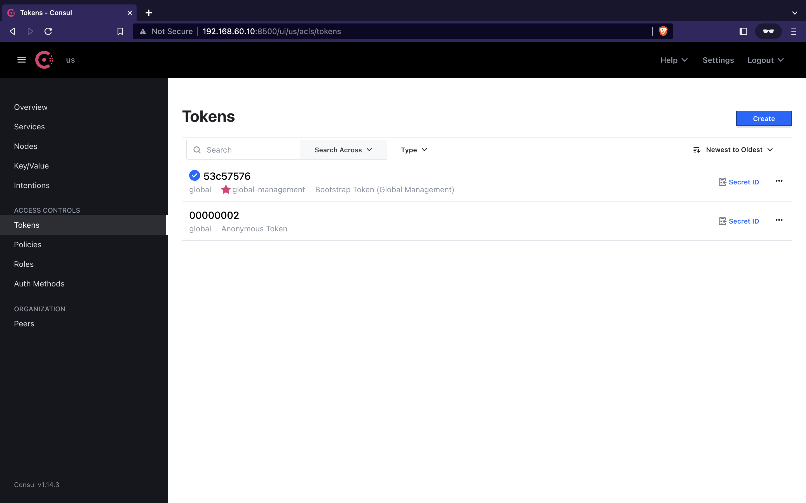
  
  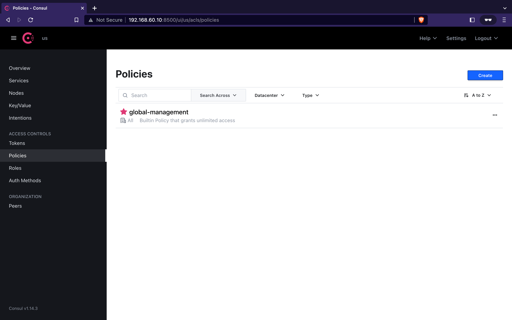

  
Nomad

   

  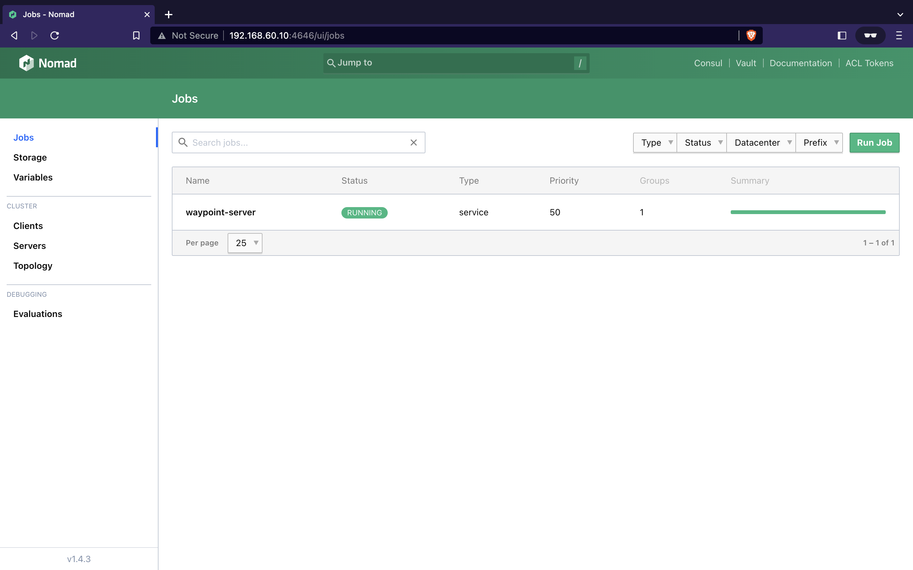

  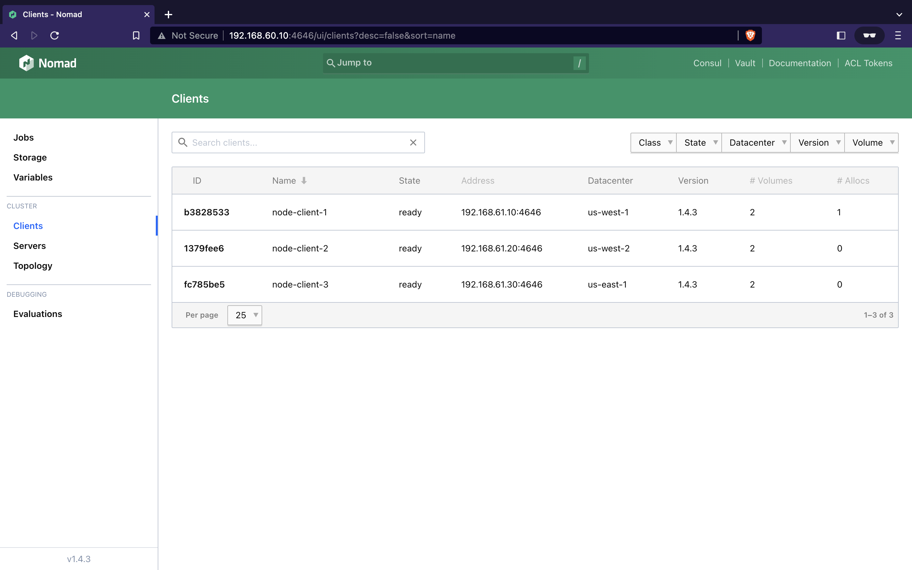

  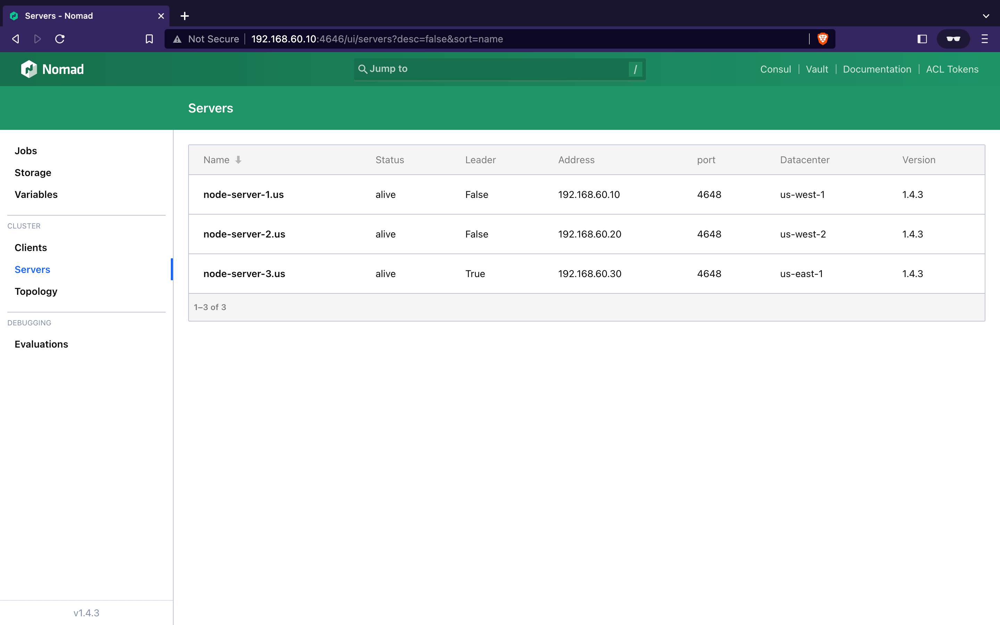

  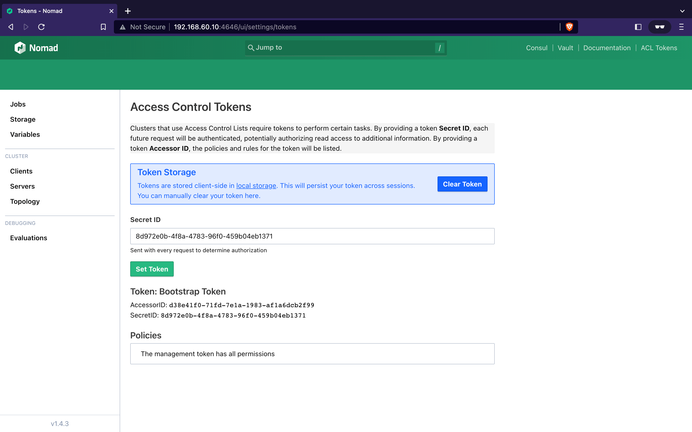
  
  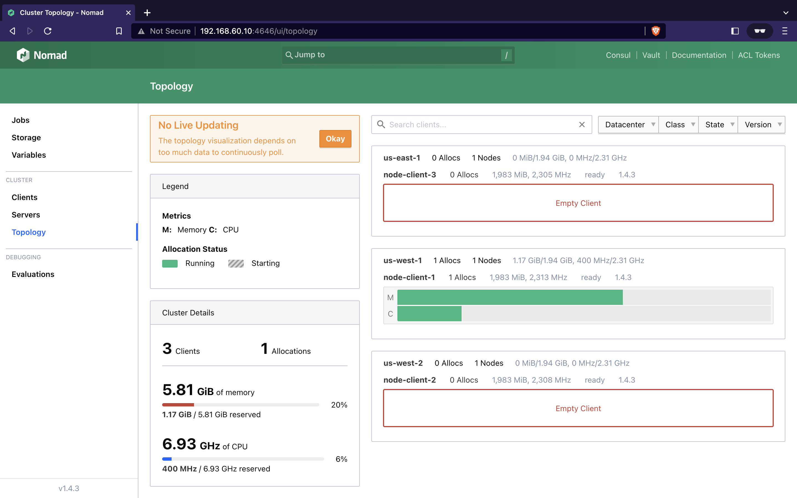

  
Vault

   

  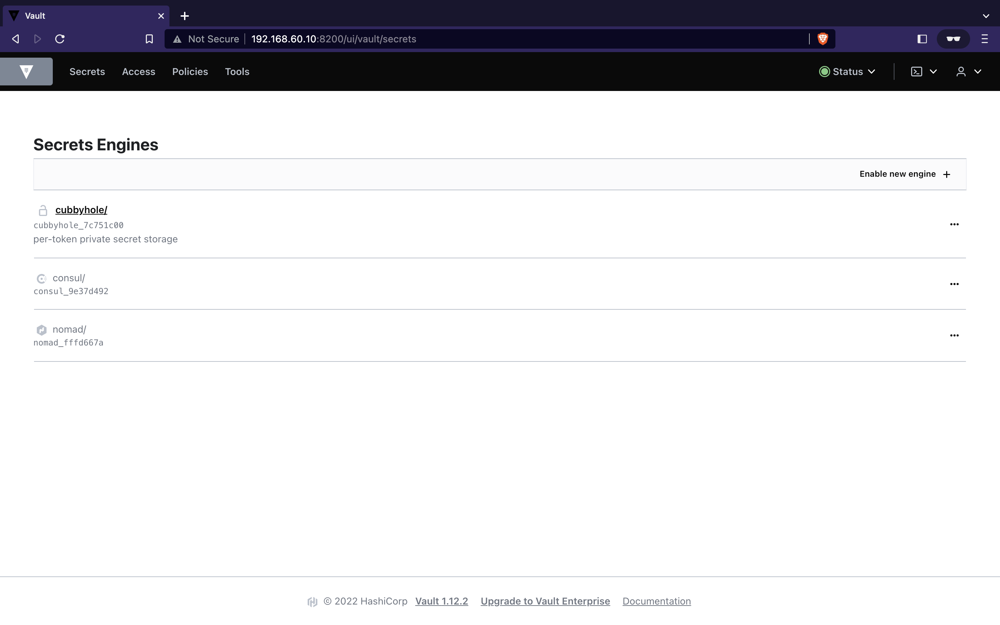

  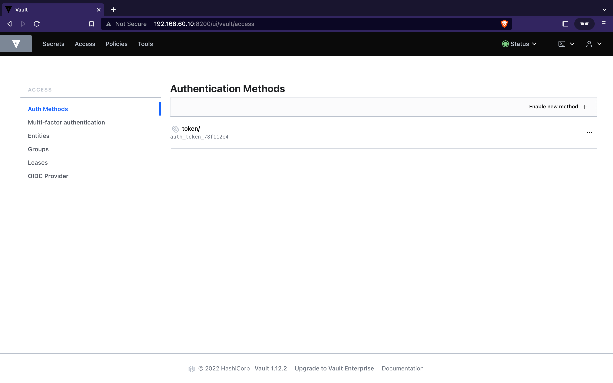

  
Waypoint

   

  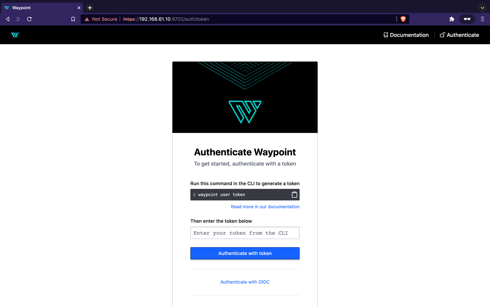

  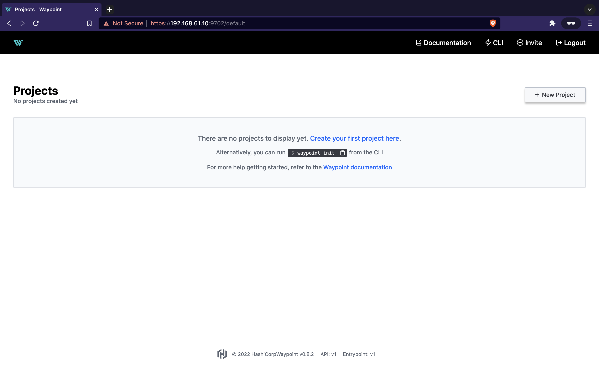

## License

Repository licensed under the [Mozilla Public License, version 2.0](./LICENSE).
