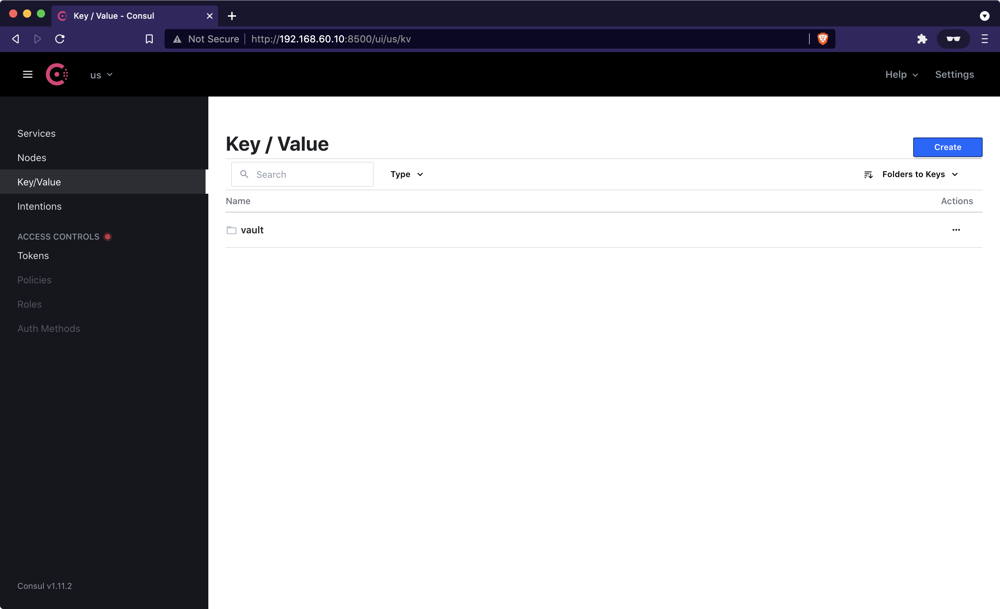
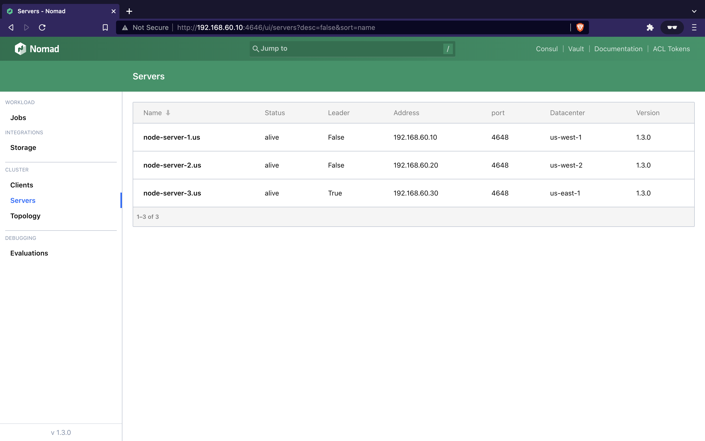
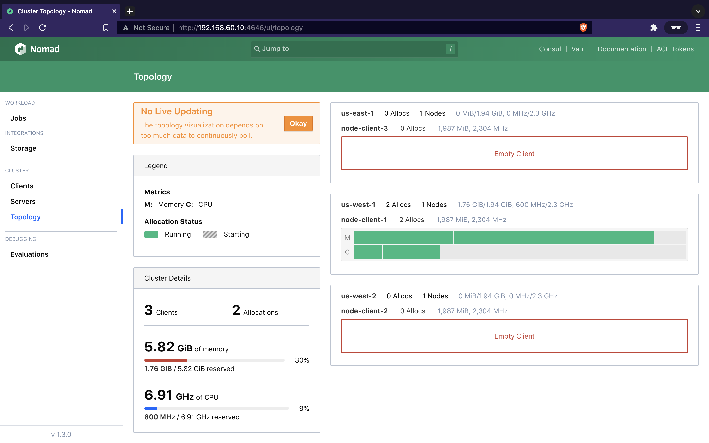
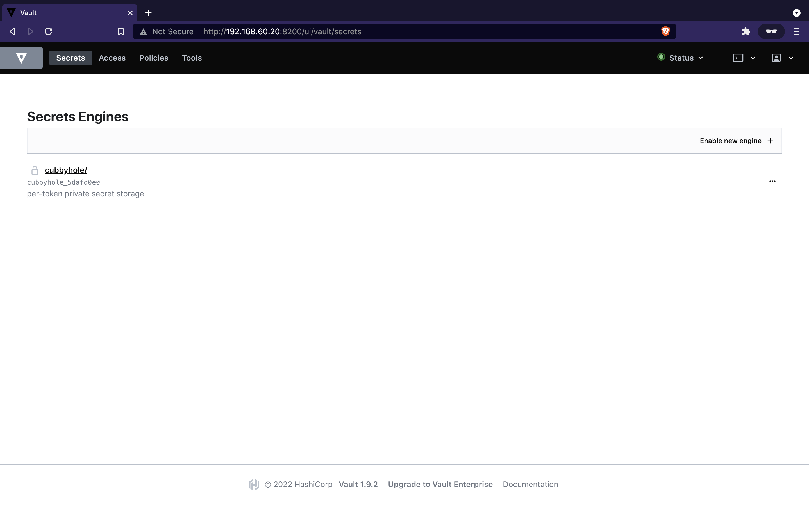
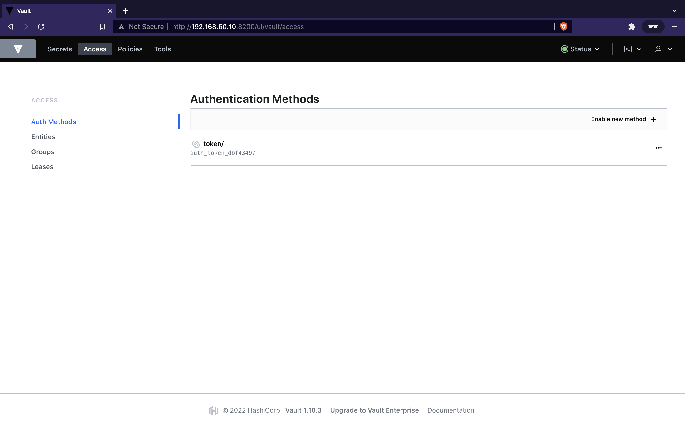

# HashiBox

HashiBox is a local environment to simulate a highly-available cloud with
[Consul](https://www.consul.io/), [Nomad](https://www.nomadproject.io/), and
[Vault](https://www.vaultproject.io/).

It also installs [Docker](https://www.docker.com/) for running Nomad's jobs
inside containers. It leverages [Vagrant](https://www.vagrantup.com/) for
virtualization, and [Bolt](https://puppet.com/docs/bolt/) for maintenance
automation across nodes.

The main goal is to provide a development setup where Nomad jobs can safely be
tested against real-life environments as close as possible.

**Notes:**
- The Vagrant environment uses a lot of resources. 1Go RAM per *client* nodes
  (x3) and 512Mo RAM per *server* nodes (x3). You should change these resources
  in the `Vagrantfile` accordingly to your machine.
- To simplify the setup, ACL and TLS across Consul, Nomad, and Vault are not
  configured. As stated, the primary goal is to test Nomad jobs in a highly
  available environment. Feel free to make a pull request to support these
  features.
- Only Vault *server* is leveraged. Vault agents in *client* mode are not setup
  since we don't use it. Feel free to make a pull request to support it.
- We could have leveraged Vagrant's *sync folders* instead of Bolt. Bolt is a
  better choice for better *production-practices*.

## Documentation

**Getting started:**
01. [Introduction](./documentation/introduction.md)
02. [Installation](./documentation/installation.md)
03. [Vault initialization](./documentation/vault-init.md)

**Other documents:**
- [Maintenance](./documentation/maintenance.md)

## Screenshots

### Consul

### Nomad

### Vault

## License

Repository licensed under the [Mozilla Public License, version 2.0](./LICENSE).
