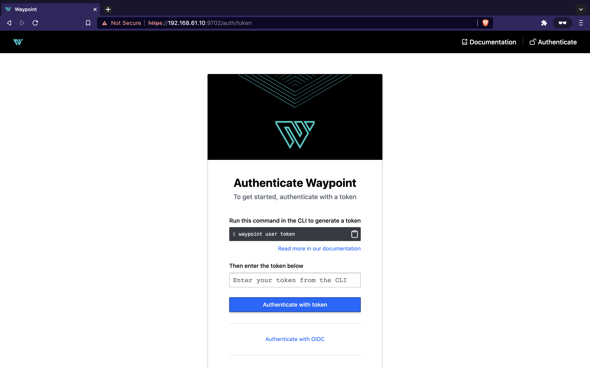

# HashiBox

HashiBox is a local environment to simulate a highly-available cloud with
[Consul](https://www.consul.io/), [Nomad](https://www.nomadproject.io/), and
[Vault](https://www.vaultproject.io/). It also installs
[Docker](https://www.docker.com/) for running Nomad's jobs inside containers.

[Waypoint](https://www.waypointproject.io/) can be added but is optional.

It leverages [Vagrant](https://www.vagrantup.com/) for virtualization, and
[Bolt](https://puppet.com/docs/bolt/) for maintenance automation across nodes.

The main goal is to provide a local environment simulating a [HashiCorp Cloud
Platform](https://cloud.hashicorp.com) setup as close as possible. This allows
to test projects from end-to-end before going live.

**Vagrant providers supported:**
- `parallels`
- `virtualbox`
- `vmware_desktop`

**Architectures supported:**
- `amd64`
- `arm64`

**Notes about the environment:**
- To simplify the setup, ACL and TLS across Consul, Nomad, Vault, and Waypoint
  are not configured. Feel free to make a pull request to support it.
- Only Vault *server* is leveraged. Vault agents in *client* mode are not setup
  since we don't use it. Feel free to make a pull request to support it.
- We could have leveraged Vagrant's *sync folders* instead of Bolt for file
  sharing with machines. Bolt is a better choice for *production-practices*
  but also for automating scripts across nodes.

## Documentation

**Getting started:**
01. [Introduction](./documentation/introduction.md)
02. [Installation](./documentation/installation.md)
03. [Vault initialization](./documentation/vault-init.md)
04. [Adding Waypoint](./documentation/waypoint.md) (optional)

**Other documents:**
- [Maintenance](./documentation/maintenance.md)

## Screenshots

  
Consul

   

  

  

  

  
Nomad

   

  

  

  

  

  
Vault

   

  

  

  
Waypoint

   

  

  

## License

Repository licensed under the [Mozilla Public License, version 2.0](./LICENSE).
