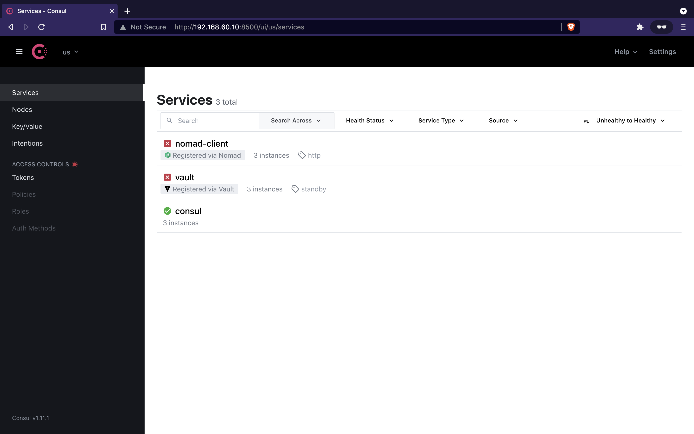

# Installation

## Prerequisites

As introduced earlier, this setup leverages [Vagrant](https://www.vagrantup.com/)
for virtualization, and [Bolt](https://puppet.com/docs/bolt/) for maintenance
automation across nodes.

You first need to install these tools before continuing.

**TLDR:** For macOS with [Homebrew](https://brew.sh/):
```bash
$ brew tap puppetlabs/puppet
$ brew install --cask puppet-bolt
$ brew install --cask vagrant
```

Other tools such as Consul, Vault, Nomad, and Docker are not required on your
local machine. They are only needed on remote nodes. They will automatically be
installed in the virtual machines.

## Running the `Vagrantfile` for the first time

> **TLDR:** You can run all the following steps simply by running:
  ```bash
  $ make init
  ```
  This will install the virtual machines, initialize the environment, and start
  the system services.

First, we need to launch the Vagrant environment, without the provision scripts.
These scripts restart system services manually because Vagrant does not provide
a way for system services to start when Vagrant ups. Since the environment is
not complete yet, we can not run these scripts.
```bash
$ vagrant up --no-provision
```

Using the `bolt` command-line, we can create a `/hashibox` directory and an
environment file for storing environment variables on all nodes:
```bash
$ bolt command run "mkdir /hashibox && touch /hashibox/.env" --targets=us --run-as root
```

We need to upload the default configuration files for all nodes acting in *server*
mode. Note the `targets` is set to the `servers` group only:
```bash
$ bolt file upload ./uploads/us/_defaults/server /hashibox/defaults --targets=servers --run-as root
```

We now need to upload specific configuration files per node to add / override
default behavior for each *server*. Note the `targets` is now specific to each
node:
```bash
$ bolt file upload ./uploads/us/us-west-1/192.168.60.10 /hashibox/overrides --targets=192.168.60.10 --run-as root
$ bolt file upload ./uploads/us/us-west-2/192.168.60.20 /hashibox/overrides --targets=192.168.60.20 --run-as root
$ bolt file upload ./uploads/us/us-east-1/192.168.60.30 /hashibox/overrides --targets=192.168.60.30 --run-as root
```

We need to do the exact same thing for nodes acting as *clients*. Upload the
default configuration files:
```bash
$ bolt file upload ./uploads/us/_defaults/client /hashibox/defaults --targets=clients --run-as root
```

Upload specific configuration files for each node acting as a *client*:
```bash
$ bolt file upload ./uploads/us/us-west-1/192.168.61.10 /hashibox/overrides --targets=192.168.61.10 --run-as root
$ bolt file upload ./uploads/us/us-west-2/192.168.61.20 /hashibox/overrides --targets=192.168.61.20 --run-as root
$ bolt file upload ./uploads/us/us-east-1/192.168.61.30 /hashibox/overrides --targets=192.168.61.30 --run-as root
```

Since every nodes now have all the configuration files they need, we can run the
installation plan that will prepare each node, and install Docker, Consul, Vault,
and Nomad on each and every one. This can take a few minutes depending on your
machine performance.
```bash
$ bolt plan run node::install --targets=us
```

## Verify installation

Given the summary table in the introduction, we can add some more information
with the appropriate links for each node:

| Datacenter  | Agent's mode | IP address    | Link to Consul              | Link to Vault               | Link to Nomad               |
|-------------|--------------|---------------|-----------------------------|-----------------------------|-----------------------------|
| `us-west-1` | server       | 192.168.60.10 | <http://192.168.60.10:8500> | <http://192.168.60.10:8200> | <http://192.168.60.10:4646> |
| `us-west-1` | client       | 192.168.61.10 | <http://192.168.61.10:8500> | <http://192.168.61.10:8200> | <http://192.168.61.10:4646> |
| `us-west-2` | server       | 192.168.60.20 | <http://192.168.60.20:8500> | <http://192.168.60.20:8200> | <http://192.168.60.20:4646> |
| `us-west-2` | client       | 192.168.61.20 | <http://192.168.61.20:8500> | <http://192.168.61.20:8200> | <http://192.168.61.20:4646> |
| `us-east-1` | server       | 192.168.60.30 | <http://192.168.60.30:8500> | <http://192.168.60.30:8200> | <http://192.168.60.30:4646> |
| `us-east-1` | client       | 192.168.61.30 | <http://192.168.61.30:8500> | <http://192.168.61.30:8200> | <http://192.168.61.30:4646> |

If we take a look at the Consul UI, this should look like this:


Vault is not yet initialized. Therefore, Vault health checks don't pass and Nomad
can't properly run since it's configured (by default) to integrate with Vault
for secrets management.

Let's initialize Vault!
