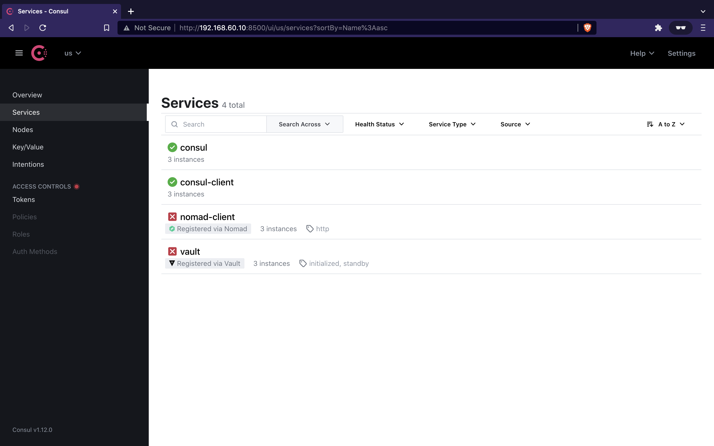

# Installation

## Prerequisites

As introduced earlier, this setup leverages [Vagrant](https://www.vagrantup.com/)
for virtualization, and [Bolt](https://puppet.com/docs/bolt/) for maintenance
automation across nodes.

You first need to install these tools before continuing.

**TLDR:** For macOS with [Homebrew](https://brew.sh/):
```bash
$ brew install homebrew/cask/vagrant
$ brew install puppetlabs/puppet/puppet-bolt
```

Other tools such as Consul, Nomad, Vault, and Docker are not required on your
local machine. They are only needed on remote nodes. They will automatically be
installed and configured in the virtual machines.

## Hypervisors and architectures

HashiBox supports multiple architectures and Vagrant providers. Customization can
be done via environment variables.

Supported environment variables are:
- `VAGRANT_PROVIDER`: `virtualbox` (default), `vmware_desktop`, `parallels`
- `UBUNTU_VERSION`: `20.04` (default, for AMD64), `20.04-arm64` (for ARM64)

We now assume you run all commands with these environment variables exported,
like this for example:
```bash
export VAGRANT_PROVIDER=parallels
export UBUNTU_VERSION=20.04-arm64
```

## Running the `Vagrantfile` for the first time

The `init` entry of the `Makefile` creates the virtual machines, initializes the
environment, and starts the services, automating the whole process. You can run
it with:
```bash
$ make init
```

We don't detail every steps to keep this guide as light as possible. Take a look
at the `Makefile` and `scripts` directory if you wish to better understand how
it works.

## Verify installation

Vault is not yet initialized. Therefore, Vault health checks don't pass and Nomad
can't properly run since it's configured to integrate with Vault. If we take a
look at the Consul UI, this should look like this:


Given the summary table in the introduction, we can add some information with the
appropriate links for each node:

| Datacenter  | Agent's mode | IP address    | Link to Consul              | Link to Nomad               | Link to Vault               |
|-------------|--------------|---------------|-----------------------------|-----------------------------|-----------------------------|
| `us-west-1` | *server*     | 192.168.60.10 | <http://192.168.60.10:8500> | <http://192.168.60.10:4646> | <http://192.168.60.10:8200> |
| `us-west-1` | *client*     | 192.168.61.10 | <http://192.168.61.10:8500> | <http://192.168.61.10:4646> | *n/a*                       |
| `us-west-2` | *server*     | 192.168.60.20 | <http://192.168.60.20:8500> | <http://192.168.60.20:4646> | <http://192.168.60.20:8200> |
| `us-west-2` | *client*     | 192.168.61.20 | <http://192.168.61.20:8500> | <http://192.168.61.20:4646> | *n/a*                       |
| `us-east-1` | *server*     | 192.168.60.30 | <http://192.168.60.30:8500> | <http://192.168.60.30:4646> | <http://192.168.60.30:8200> |
| `us-east-1` | *client*     | 192.168.61.30 | <http://192.168.61.30:8500> | <http://192.168.61.30:4646> | *n/a*                       |

As stated, Nomad currently can't properly run. The links related to Nomad will not
work until Vault is initialized.

---

**Next:** [Vault initialization](./vault-init.md)
