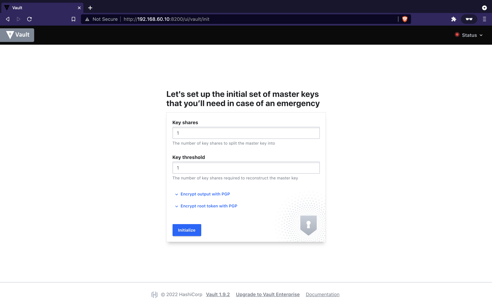
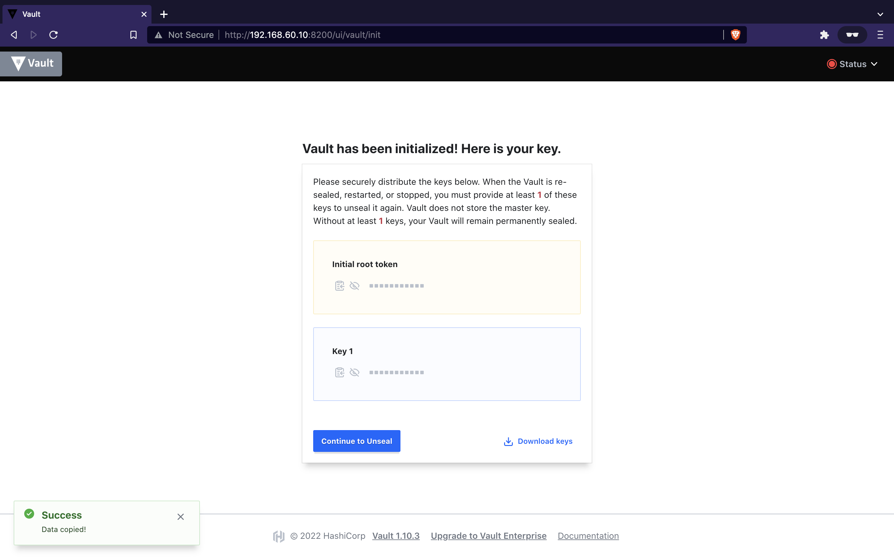
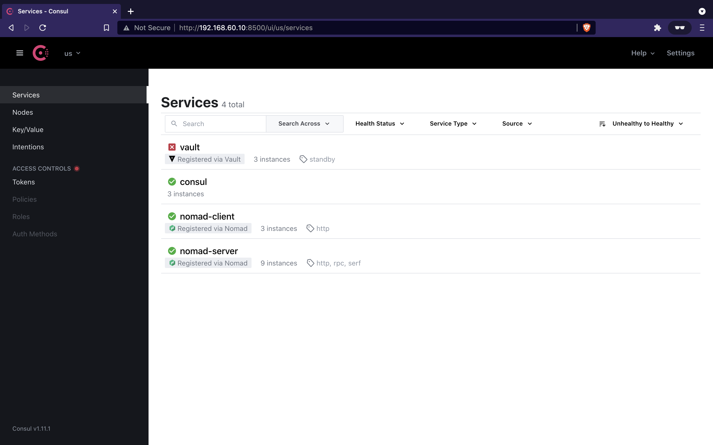
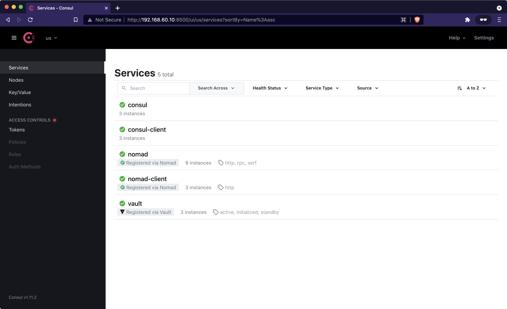
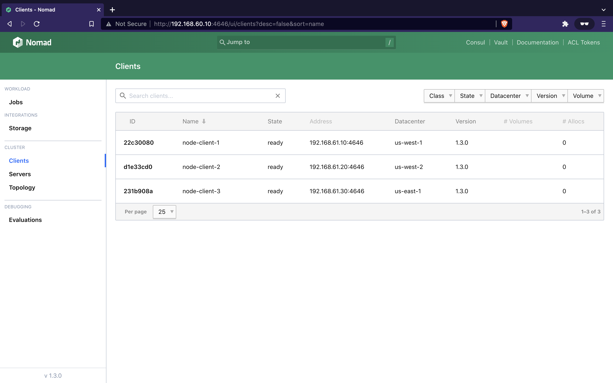

# Vault initialization

Once the Vagrant setup is done, you must initialize (and unseal Vault *servers*)
in order for Nomad to work as expected.

## Initialize Vault

If you go to <http://192.168.60.10:8200> you will see the Vault UI for the server
node on the `eu-west-1` datacenter. For our demo, let's configure Vault simply
with:


Copy and paste in your notes the initial root token given as well as the key:


## Restart the environment

You can now restart the Consul, Nomad, and Vault with the Vault token:
```bash
$ export VAULT_TOKEN=<token>
$ make sync
```

This will restart the services and pass the `VAULT_TOKEN` environment variable
down to the Vagrant boxes. This way, it can be used by Consul and Nomad for
interacting with Vault.

## Unseal Vault

If you access the Consul UI at <http://192.168.60.10:8500>, you will note that
Vault is still not healthy:


It is because you need to unseal Vault on every node. To achieve this, you can
use the `make unseal` command as follow:
```bash
$ export VAULT_UNSEAL_KEY=<key>
$ make unseal
```

In Consul, we can see that every health checks are now passing and the service list
looks like this:


Since Vault is heathly, Nomad can interact with it via the root token passed with
`VAULT_TOKEN`. Let's take a look at Nomad:


---

**Next:** [Adding Waypoint](./waypoint.md) (optional)
